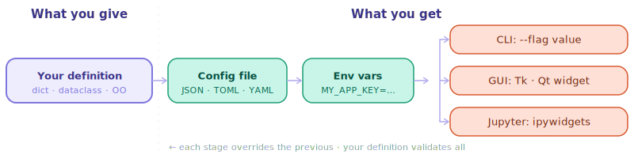
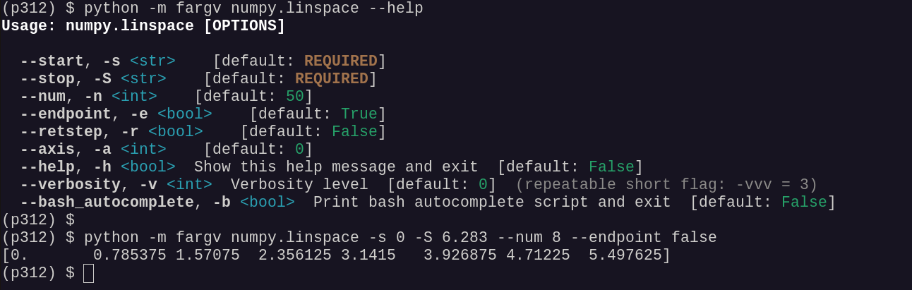

# fargv

<p align="center">
  
</p>

[](https://github.com/anguelos/fargv/actions/workflows/tests.yml)
[](https://github.com/anguelos/fargv/actions/workflows/tests.yml)
[](https://pypi.org/project/fargv/)
[](https://pypi.org/project/fargv/)
[](https://fargv.readthedocs.io/en/latest/)
[](https://pypi.org/project/fargv/)
[](https://github.com/anguelos/fargv)

A very easy to use argument parser for Python scripts — a zero-boilerplate
replacement for `argparse`, `click`, `typer`, and similar CLI libraries.
Define your parameters once as a plain dict, a dataclass, or a type-annotated
function signature; fargv infers types, generates `--help`, assigns short-name
aliases, reads a config file (JSON, YAML, TOML, or INI), applies environment
variable overrides, and optionally opens a GUI — all without any additional
configuration.



## Features

**Multiple definition styles** — choose the style that fits your script:
plain Python dicts (zero imports), `@dataclass` definitions (type-safe return
values, IDE completion), or ordinary type-annotated functions.  fargv covers the
full argparse feature set and adds first-class dataclass support.

**Config file integration** — every script automatically reads from a JSON
config file at `~/.{scriptname}.config.json`.  YAML, TOML, and INI formats are
also supported via the `--config` flag.  Command-line values always override the
config file.

**Environment variable overrides** — parameters can be set via environment
variables with auto-derived names (`SCRIPTNAME_PARAMNAME`).  The override
priority is: coded default → config file → environment variable → CLI.  No
annotation or registration is needed; fargv derives the variable names
automatically.

**Subcommands** — nested dicts are automatically interpreted as git-style
subcommand trees.  Flags are routed by name rather than position, so parent
flags and subcommand flags can be mixed freely on the command line.

**GUI backends** — pass `--user_interface tk` to open a Tkinter dialog,
`--user_interface qt` for a PyQt / PySide window, or run inside a Jupyter
notebook to get ipywidgets automatically.  The same parameter definition drives
the CLI, the Tk GUI, the Qt GUI, and the Jupyter widget interface — no extra
code required.

**Bash tab completion** — run `source <(myscript.py --bash_autocomplete)` to
enable shell completion for all flags and subcommand names.

**No runtime dependencies** — the core library uses only the Python standard
library.  GUI backends (tkinter, PyQt, PySide, ipywidgets) are optional and
loaded only when requested.

## Installation

```bash
pip install fargv
```

## Quick start

Pass a plain dict — types, short names, config file, and env-var overrides are
all inferred automatically.

```python
import fargv

p, _ = fargv.parse({
    "data_dir":   "/data",                   # str — base path, referenced below
    "output_dir": "{data_dir}/results",      # str — resolved via {data_dir}
    "mode":       ("train", "eval", "test"), # choice — first element is default
    "verbose":    False,                     # bool switch
    "files":      [],                        # positional — collects leftover args
})

print(f"Reading from {p.data_dir}, writing to {p.output_dir}")
print(f"Mode: {p.mode}  verbose: {p.verbose}  files: {p.files}")
```

```bash
python myscript.py --data_dir=/datasets/cifar --mode=eval --verbose model_a.pt model_b.pt
# data_dir=/datasets/cifar  output_dir=/datasets/cifar/results
# mode=eval  verbose=True  files=['model_a.pt', 'model_b.pt']
```

Every parameter automatically gets a short flag inferred from its name
(`-d`, `-o`, `-m`, `-V`, …), `--help` output, bash tab-completion, a config
file at `~/.myscript.config.json`, and env-var overrides (`MYSCRIPT_MODE=eval`).

For full control — descriptions, path validation, stream parameters — pass
explicit `FargvParameter` objects as dict values:

```python
p, _ = fargv.parse({
    "data_dir":   fargv.FargvStr("/data",            description="Root input directory"),
    "output_dir": fargv.FargvStr("{data_dir}/results",description="Output path ({data_dir} resolved)"),
    "mode":       fargv.FargvChoice(["train","eval","test"], description="Run mode"),
    "verbose":    fargv.FargvBool(False,             description="Enable verbose logging"),
    "files":      fargv.FargvPositional([],           description="Input files"),
})
```

The CLI behaviour is identical; the explicit form adds per-parameter
descriptions in `--help`.

## Call any Python function from the shell

`python -m fargv` invokes any Python callable directly — types and defaults are
inferred from the function's signature, no wrapper code required.

```bash
python -m fargv numpy.linspace --help
python -m fargv numpy.linspace -s 0 -S 6.283 --num 8 --endpoint false
```



Pass `--user_interface tk` (or `qt`) to open a GUI instead:

```bash
python -m fargv numpy.linspace -s 0 -S 6.283 --num 8 --endpoint false --user_interface tk
```


## Comparison with other argument parsers

| Feature | [fargv](https://github.com/anguelos/fargv) | [argparse](https://docs.python.org/3/library/argparse.html) | [click](https://click.palletsprojects.com/) | [typer](https://typer.tiangolo.com/) | [fire](https://github.com/google/python-fire) | [docopt](http://docopt.org/) |
|---|:---:|:---:|:---:|:---:|:---:|:---:|
| Zero boilerplate | ✅ | ❌ | 🟡 | 🟡 | ✅ | 🟡 |
| Type inference from defaults | ✅ | ❌ | ❌ | ❌ | 🟡 | ❌ |
| Type inference from annotations | ✅ | ❌ | ❌ | ✅ | ✅ | ❌ |
| Auto-generated help | ✅ | ✅ | ✅ | ✅ | ✅ | ✅ |
| Auto short-name inference | ✅ | ❌ | ❌ | ❌ | ❌ | ❌ |
| Config file (built-in) | ✅ | ❌ | ❌ | ❌ | ❌ | ❌ |
| String interpolation | ✅ | ❌ | ❌ | ❌ | ❌ | ❌ |
| Subcommands | ✅ | ✅ | ✅ | ✅ | ✅ | 🟡 |
| `python -m pkg.func` invocation | ✅ | ❌ | ❌ | ❌ | ✅ | ❌ |
| Bash tab completion | 🟡 | 🟡 | ✅ | ✅ | 🟡 | ❌ |
| No runtime dependencies | ✅ | ✅ | ❌ | ❌ | ❌ | ❌ |
| Environment variable override | ✅ | ❌ | ✅ | ✅ | ❌ | ❌ |
| GUI / widget interface | ✅ | ❌ | ❌ | ❌ | ❌ | ❌ |
| zsh / fish completion | ❌ | 🟡 | ✅ | ✅ | 🟡 | ❌ |
| Mutually exclusive parameters | ❌ | ✅ | ✅ | ✅ | ❌ | 🟡 |
| Parameter validation / constraints | 🟡 | 🟡 | ✅ | ✅ | ❌ | ❌ |
| Async command support | ❌ | ❌ | ✅ | ✅ | ❌ | ❌ |
| Interactive prompts / password input | ❌ | ❌ | ✅ | ✅ | ❌ | ❌ |
| Decorator-based API | ❌ | ❌ | ✅ | ✅ | ❌ | ❌ |
| Type-safe return value | 🟡 | ❌ | 🟡 | ✅ | ❌ | ❌ |

✅ built-in  · 🟡 available with extra work or plugins  · ❌ not supported

**fargv notes:**
Bash tab completion generates a script via `--bash_autocomplete` that must be sourced manually.
Parameter validation covers path constraints (`FargvExistingFile`, `FargvNonExistingFile`, `FargvFile`) but not numeric ranges or regex patterns.
Type-safe return requires passing a dataclass as the definition; the default `SimpleNamespace` is untyped.

## License

MIT

---

<details>
<summary><strong>Legacy API (ver.&lt;0.1.9)</strong></summary>

The original API uses single-dash flags and `fargv.fargv()` instead of
`fargv.parse()`.  It is still fully supported but new scripts should use
`fargv.parse`.

```python
import fargv

p, _ = fargv.fargv({
    "name":    "world",            # str
    "count":   1,                  # int
    "verbose": False,              # bool flag
    "mode":    ("fast", "slow"),   # choice, first is default
    "files":   set(),              # positional list
})

print(f"Hello, {p.name}! count={p.count}")
```

```bash
python myscript.py -name=Alice -count=3 -verbose -mode=slow -files a.txt b.txt c.txt
```

Attach a description with a two-element tuple:

```python
p, _ = fargv.fargv({
    "epochs": (10,    "Number of training epochs"),
    "lr":     (0.001, "Learning rate"),
})
```

</details>
