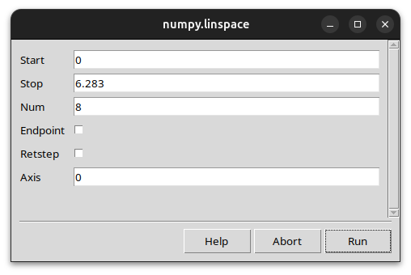

# fargv Features

This page documents each unique fargv feature with a runnable example,
an explanation, and (where applicable) instructions for enabling or
disabling it.  At the bottom, a [comparison table](#comparison-with-other-frameworks)
shows how these features stack up against popular alternatives.

---

## Type inference from Python literals

fargv maps plain Python values to CLI parameter types automatically — no
decorators, no annotations, no schema classes required.

```python
import fargv

p, _ = fargv.parse({
    "name":    "world",          # → str
    "count":   1,                # → int
    "lr":      0.001,            # → float
    "verbose": False,            # → bool flag
    "mode":    ("fast", "slow", "medium"),  # → choice (first = default)
    "files":   [],               # → variadic list
})
```

```text
$ python script.py --help

Help for script

Usage: script [OPTIONS]

  --name, -n <str>      [default: 'world']
  --count, -c <int>     [default: 1]
  --lr, -l <float>      [default: 0.001]
  --verbose, -v <bool>  [default: False]  (switch: --flag sets True)
  --mode, -m <str>      [default: 'fast']  choices: ['fast', 'slow', 'medium']
  --files, -f <list>    [default: []]
```

**Type inference table**

| Default value | Inferred type | CLI syntax |
|---|---|---|
| `False` / `True` | `FargvBool` | `--verbose` or `--verbose=false` |
| `0`, `42` | `FargvInt` | `--count=3` |
| `0.0`, `3.14` | `FargvFloat` | `--lr=1e-4` |
| `"hello"` | `FargvStr` | `--name=Alice` |
| `("a","b","c")` ≥ 3 items | `FargvChoice` | `--mode=b` |
| `(default, "desc")` 2 items | *any* + description | — |
| `[]` | `FargvVariadic` | trailing tokens |
| `{"sub": {...}}` | `FargvSubcommand` | `prog sub --flag` |

> **Disable**: not applicable — type inference is the definition mechanism.
> Replace any literal with an explicit `Fargv*` object to override it.

---

## Four definition styles

fargv accepts four distinct forms of parser definition, each suited to a
different development context. All styles produce the same CLI interface and
return `(namespace, help_str)`.

| Style | Returns | Best for |
|---|---|---|
| Plain dict | `SimpleNamespace` | prototypes, notebooks |
| Dict with `Fargv*` types | `SimpleNamespace` | production scripts needing descriptions |
| Dataclass | dataclass instance | typed configs, IDE autocompletion |
| Function signature | `SimpleNamespace` | exposing existing callables |

```python
# Style 1 — plain dict
p, _ = fargv.parse({"lr": 0.01, "epochs": 10})

# Style 2 — dict with Fargv* types
p, _ = fargv.parse({"lr": fargv.FargvFloat(0.01, description="Learning rate")})

# Style 3 — dataclass
from dataclasses import dataclass
@dataclass
class Cfg:
    lr: float = 0.01
    epochs: int = 10
cfg, _ = fargv.parse(Cfg)   # cfg is a Cfg instance

# Style 4 — function signature
def train(lr: float = 0.01, epochs: int = 10): ...
p, _ = fargv.parse(train)
```

See [Defining a Parser](defining_parsers.md) for full coverage of each style.

---

## `{key}` string interpolation

`FargvStr` parameters (and plain `str` defaults in dict style) support
`{key}` cross-references to sibling string parameters. Interpolation is
resolved at parse time, after all overrides are applied.

```python
import fargv

p, _ = fargv.parse({
    "base":    "/data",
    "model":   "resnet50",
    "out":     "{base}/runs/{model}",
    "logs":    "{base}/logs",
})
```

```text
$ python script.py --base=/mnt/storage --model=vit_b16
p.out  → /mnt/storage/runs/vit_b16
p.logs → /mnt/storage/logs
```

Interpolation follows CLI override order: if `--base` is changed on the
command line, every `{base}` reference reflects the new value.

> **Limitation**: interpolation only works within `str` / `FargvStr`
> parameters.  It is not supported in dataclass style across fields.

---

## Mandatory parameters

Mark a parameter as required with the `fargv.REQUIRED` sentinel. fargv
raises `FargvError` immediately when a mandatory parameter is missing.

```python
import fargv

p, _ = fargv.parse({
    "weights": fargv.FargvStr(fargv.REQUIRED, description="Pretrained weights"),
    "lr":      0.01,
})
```

```text
$ python train.py
Error: Required parameter 'weights' was not provided

$ python train.py --weights=model.pt
weights=model.pt  lr=0.01
```

In **dataclass** style, omit the default entirely:

```python
from dataclasses import dataclass
import fargv

@dataclass
class Config:
    checkpoint: str           # no default → mandatory
    threshold:  float = 0.5

cfg, _ = fargv.parse(Config)
```

In **function** style, use `non_defaults_are_mandatory=True`:

```python
def run(host: str, port: int = 8080): ...
p, _ = fargv.parse(run, non_defaults_are_mandatory=True)
```

> **Disable**: provide a default value instead of `REQUIRED`.

---

## Count-switch parameters (`-vvv`)

`FargvInt` with `is_count_switch=True` accumulates repeated short flags.
`-vvv` sets the value to `3`. Also accepts `--verbose=2` for direct
assignment.

```python
import fargv

p, _ = fargv.parse({
    "verbose": fargv.FargvInt(0, short_name="v", is_count_switch=True),
    "model":   "resnet50",
})
```

```text
$ python script.py -vvv
verbose=3

$ python script.py --verbose=2
verbose=2
```

The auto-injected `--verbosity` / `-v` parameter uses this mechanism by
default; disable it with `auto_define_verbosity=False` if you define your
own verbosity switch.

> **Enable**: `FargvInt(0, is_count_switch=True)`.
> **Disable**: use a plain `FargvInt` or `int` literal instead.

---

## Automatic short-name aliases

Every parameter gets a single-character `-x` alias derived from its long
name without any configuration. fargv picks the first unique character,
falling back to later characters to avoid collisions.

```python
import fargv

fargv.parse({
    "learning_rate": 0.01,
    "batch_size":    32,
    "output_dir":    "./runs",
}, given_parameters=["prog", "--help"],
   auto_define_bash_autocomplete=False, auto_define_config=False,
   auto_define_verbosity=False, auto_define_user_interface=False,
   colored_help=False)
```

```text
Help for prog

Usage: prog [OPTIONS]

  --learning_rate, -l <float>  [default: 0.01]
  --batch_size, -b <int>       [default: 32]
  --output_dir, -o <str>       [default: './runs']
```

Override the auto-alias with `short_name=`:

```python
fargv.FargvInt(0, short_name="v", is_count_switch=True)
```

> **Disable per-parameter**: set `short_name=None` on the `Fargv*` object.
> **Disable globally**: not currently supported; use `short_name=None` per param.

---

## Config file support

fargv automatically injects a `--config` / `-C` parameter.  Point it at a
JSON, YAML, TOML, or INI file; those values override coded defaults but are
themselves overridden by any CLI flags.

```text
$ cat ~/.train_py.config.json
{"lr": 0.001, "epochs": 50}

$ python train.py --config=~/.train_py.config.json --epochs=100
# lr=0.001 (from config), epochs=100 (CLI wins)
```

**Generating a config file**

Pass `//format` to dump all current parameter values in the chosen format and
exit.  Pipe the output to create a config file:

```text
$ python train.py --lr=0.001 --config //json
{
  "fargv_comment.lr": "Learning rate.  type: float  default: 0.01  env var: TRAIN_LR",
  "lr": 0.001,
  "epochs": 10
}
fargv: to persist, redirect to: /home/user/.train_py.config.json

$ python train.py --lr=0.001 --config //json > ~/.train_py.config.json
```

On the next run those values load automatically from the saved file.

Supported formats: `//json`, `//ini`, `//toml`, `//yaml`.  The suggested save
path uses the matching file extension.

**Flat key convention**

Config files use flat keys.  Subcommand branch parameters are prefixed with the
branch name and a dot:

```json
{
  "lr": 0.001,
  "train.lr": 0.005,
  "train.epochs": 50
}
```

The subcommand field name itself (`cmd`, etc.) is not a valid key — only branch
names are used as prefixes.

**JSON pseudo-comments**

Keys starting with `fargv_comment` are silently dropped by the loader.  The
dump functions write them automatically to annotate each parameter with its
help text and env var name.

**Unknown keys**

If a config file contains any unknown key, fargv warns to stderr and ignores
the entire dict by default.  Change with the `unknown_keys` argument to
`parse()`: `"ignore_key_and_warn"` (skip bad keys, apply rest) or `"raise"`
(FargvError).

> **Disable**: pass `auto_define_config=False` to `fargv.parse(...)`.

---

## Environment variable overrides

Every parameter can be overridden by an environment variable.  The naming is
flat with an app-name prefix, using underscore as separator:

```
{APPNAME}_{KEY}   (all uppercase)
```

For a subcommand branch parameter — e.g. `lr` inside branch `train` of
`train.py` — the env var is `TRAIN_PY_TRAIN_LR`.

```text
$ TRAIN_PY_LR=0.001 python train.py
# lr=0.001 (from env), other params use coded defaults

$ TRAIN_PY_LR=0.001 python train.py --lr=1e-4
# lr=0.0001 (CLI wins over env)
```

Override order (lowest → highest priority):
`coded default → config file → env var → CLI / GUI`

> **Disable**: pass `override_order=["default", "config", "ui"]` to skip env vars.


## Subcommands

A nested dict whose values are all dicts (or callables / `ArgumentParser`)
is inferred as a subcommand tree — git-style nested sub-parsers.

```python
import fargv

p, _ = fargv.parse({
    "verbose": False,
    "cmd": {
        "train": {"lr": 0.01, "epochs": 10},
        "eval":  {"dataset": "val"},
    },
})
```

```text
$ python prog.py --help

  --verbose, -v <bool>   [default: False]
  cmd  [train|eval]  default: 'train'
    train:
      --lr, -l <float>   [default: 0.01]
      --epochs, -e <int> [default: 10]
    eval:
      --dataset, -d <str> [default: 'val']

$ python prog.py train --lr=0.001
cmd=train  lr=0.001  epochs=10

$ python prog.py eval --dataset=test
cmd=eval  dataset=test
```

Use `subcommand_return_type="nested"` to keep sub-params in a namespace:

```python
p, _ = fargv.parse({...}, subcommand_return_type="nested")
# p.cmd.name == "train"
# p.cmd.lr   == 0.001
```

---

## Bash autocomplete

fargv generates a bash completion script for any script. Source it once and
tab-complete parameter names.

```text
$ source <(python myscript.py --bash_autocomplete)
$ python myscript.py --<TAB>
--lr  --epochs  --verbose  --help  --config  ...
```

> **Disable**: pass `auto_define_bash_autocomplete=False` to `fargv.parse(...)`.

---

## GUI backends

Pass `--user_interface=tk` or `--user_interface=qt` to open a graphical
dialog pre-populated with all parameters and their current values.

```text
$ python train.py --user_interface=tk
```



Jupyter widget backend is also available when `ipywidgets` is installed:

```python
# In a Jupyter notebook — detected automatically
p, _ = fargv.parse({"lr": 0.01, "epochs": 10})
# renders an ipywidgets form inline
```

> **Disable**: pass `auto_define_user_interface=False` to `fargv.parse(...)`.
> **Require specific backend**: `ui="tk"` or `ui="qt"` in `fargv.parse(...)`.

---

## Zero-script CLI (`python -m fargv`)

Invoke any importable Python callable directly from the shell — no wrapper
script needed. fargv introspects the function signature and builds the CLI
on the fly.

```text
$ python -m fargv numpy.linspace --start=0 --stop=6.283 --num=8
[0.         0.8975979  1.7951958  2.6927937  3.5903916  4.4879895
 5.3855874  6.2831853]

$ python -m fargv numpy.linspace --help
Help for linspace

  --start, -s <float>    [default: REQUIRED]
  --stop, -S <float>     [default: REQUIRED]
  --num, -n <int>        [default: 50]
  --endpoint, -e <bool>  [default: True]
  ...
```

Works with any importable callable: your own modules, stdlib, or
third-party libraries.

---

## `parse_and_launch`

A single call that parses CLI arguments and immediately invokes the target
function with them. Equivalent to `p, _ = fargv.parse(fn); fn(**vars(p))`.

```python
import fargv

def train(lr: float = 0.01, epochs: int = 10, amp: bool = False):
    print(f"training  lr={lr}  epochs={epochs}  amp={amp}")

fargv.parse_and_launch(train)
```

```text
$ python train.py --lr=0.001 --amp
training  lr=0.001  epochs=10  amp=True
```

---

## `parse_here()`

Called from **inside** a function, `parse_here()` resolves the calling
function's own signature without passing it explicitly.

```python
import fargv

def train(lr: float = 0.01, epochs: int = 10):
    p, _ = fargv.parse_here()   # resolves train's own signature
    print(f"lr={p.lr}  epochs={p.epochs}")

train()
```

```text
$ python train.py --lr=0.001
lr=0.001  epochs=10
```

Works inside regular functions, instance methods, and class methods.

---

## Variadic parameters

An empty `list` default (or `FargvVariadic`) collects all unmatched CLI
tokens into an ordered list — useful for file arguments and batch inputs.

```python
import fargv

p, _ = fargv.parse({
    "model":  "resnet50",
    "images": [],           # variadic — catches leftover tokens
})
```

```text
$ python infer.py --model=vit a.jpg b.jpg c.jpg
model=vit  images=['a.jpg', 'b.jpg', 'c.jpg']
```

With a description:

```python
{"checkpoints": fargv.FargvVariadic(default=[], description="checkpoint files")}
```

> Only one variadic parameter per parser is supported.

---

## Rich path / file types

fargv provides path parameters that validate existence or parent-directory
availability at parse time, before your code runs.

| Class | Validation |
|---|---|
| `FargvPath` | returns `pathlib.Path`; no existence check |
| `FargvExistingFile` | file must exist |
| `FargvNonExistingFile` | path must **not** exist |
| `FargvFile` | parent directory must exist |

```python
import fargv

p, _ = fargv.parse({
    "weights": fargv.FargvExistingFile(fargv.REQUIRED,
                   description="model checkpoint (must exist)"),
    "output":  fargv.FargvFile("/tmp/result.pt",
                   description="output path (parent dir must exist)"),
})
```

```text
Help for infer

  --weights, -w <Path>  [default: REQUIRED]  (must exist)
  --output, -o <Path>   [default: '/tmp/result.pt']  (parent dir must exist)

$ python infer.py --weights=missing.pt
Error: File 'missing.pt' does not exist
```

---

(comparison-with-other-frameworks)=
## Comparison with other frameworks

Features that are rare or absent in mainstream argument parsers.
✅ = supported natively · ⚠️ = partial / plugin required · ❌ = not supported

| Feature | [fargv](https://github.com/anguelos/fargv) | [argparse](https://docs.python.org/3/library/argparse.html) | [click](https://click.palletsprojects.com/) | [typer](https://typer.tiangolo.com/) | [fire](https://github.com/google/python-fire) | [hydra](https://hydra.cc/) | [docopt](http://docopt.org/) | [tap](https://github.com/swansonk14/typed-argument-parser) |
|---|:---:|:---:|:---:|:---:|:---:|:---:|:---:|:---:|
| Type inference from Python literals | ✅ | ❌ | ❌ | ❌ | ✅ | ❌ | ❌ | ❌ |
| Four definition styles | ✅ | ❌ | ❌ | ❌ | ❌ | ❌ | ❌ | ❌ |
| `{key}` string interpolation | ✅ | ❌ | ❌ | ❌ | ❌ | ✅ | ❌ | ❌ |
| Mandatory params | ✅ | ✅ | ✅ | ✅ | ❌ | ✅ | ✅ | ✅ |
| Count-switch (`-vvv`) | ✅ | ⚠️ | ✅ | ❌ | ❌ | ❌ | ❌ | ❌ |
| Auto short-name aliases | ✅ | ❌ | ❌ | ❌ | ❌ | ❌ | ❌ | ❌ |
| Config file (built-in) | ✅ | ❌ | ⚠️ | ⚠️ | ❌ | ✅ | ❌ | ❌ |
| Env-var overrides (built-in) | ✅ | ❌ | ✅ | ✅ | ❌ | ✅ | ❌ | ❌ |
| Subcommands | ✅ | ✅ | ✅ | ✅ | ✅ | ✅ | ✅ | ✅ |
| Bash autocomplete (built-in) | ✅ | ❌ | ✅ | ✅ | ❌ | ❌ | ❌ | ❌ |
| GUI backends | ✅ | ❌ | ❌ | ❌ | ❌ | ❌ | ❌ | ❌ |
| Zero-script CLI (`-m module.fn`) | ✅ | ❌ | ❌ | ❌ | ✅ | ❌ | ❌ | ❌ |
| Parse + launch one-liner | ✅ | ❌ | ✅ | ✅ | ✅ | ❌ | ❌ | ❌ |
| Self-resolving `parse_here()` | ✅ | ❌ | ❌ | ❌ | ❌ | ❌ | ❌ | ❌ |
| Positional parameter list | ✅ | ✅ | ✅ | ✅ | ✅ | ✅ | ✅ | ✅ |
| Path / file validation (built-in) | ✅ | ⚠️ | ✅ | ✅ | ❌ | ❌ | ❌ | ❌ |

